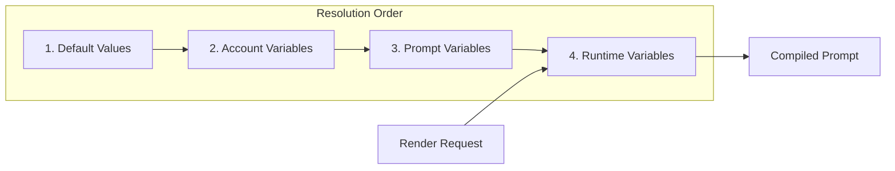

# Variables Management System - Shortest Path Implementation

## Overview

Design for a two-tier variable system with account-level and prompt-level variables, featuring @ autocomplete in the prompt editor.

---

## 1. Database Schema (Minimal)

### Account Variables Table
```sql
CREATE TABLE IF NOT EXISTS account_variables (
    id TEXT PRIMARY KEY,
    user_id TEXT NOT NULL,
    name TEXT NOT NULL UNIQUE,-- e.g., "company_name"
    value TEXT NOT NULL,-- e.g., "Acme Corp"
    description TEXT,-- optional description
    created_at TEXT,
    updated_at TEXT,
    FOREIGN KEY (user_id) REFERENCES users(id),
    UNIQUE(user_id, name)
);
```

### Prompt Variables Table
```sql
CREATE TABLE IF NOT EXISTS prompt_variables (
    id TEXT PRIMARY KEY,
    prompt_id TEXT NOT NULL,
    version TEXT DEFAULT 'v1',-- version-specific variables
    name TEXT NOT NULL,
    value TEXT,-- default value (optional)
    description TEXT,
    required INTEGER DEFAULT 0,-- is this required at render time?
    created_at TEXT,
    updated_at TEXT,
    FOREIGN KEY (prompt_id) REFERENCES prompts(id),
    UNIQUE(prompt_id, version, name)
);
```

### Migration Location
Add to [`init_db()`](backend/server.py:67) function after existing table definitions.

---

## 2. Backend API Endpoints (Minimal)

### Account Variables Endpoints

| Method | Endpoint | Description |
|--------|----------|-------------|
| GET | `/api/account-variables` | List all account variables |
| POST | `/api/account-variables` | Create account variable |
| PUT | `/api/account-variables/{name}` | Update account variable |
| DELETE | `/api/account-variables/{name}` | Delete account variable |

### Prompt Variables Endpoints

| Method | Endpoint | Description |
|--------|----------|-------------|
| GET | `/api/prompts/{prompt_id}/variables` | List prompt variables (all versions) |
| GET | `/api/prompts/{prompt_id}/variables?version={v}` | List variables for specific version |
| POST | `/api/prompts/{prompt_id}/variables` | Create prompt variable |
| PUT | `/api/prompts/{prompt_id}/variables/{name}` | Update prompt variable |
| DELETE | `/api/prompts/{prompt_id}/variables/{name}` | Delete prompt variable |

### Combined Variables Endpoint (for autocomplete)

| Method | Endpoint | Description |
|--------|----------|-------------|
| GET | `/api/prompts/{prompt_id}/available-variables` | Get merged list of account + prompt variables |

### Pydantic Models

```python
class AccountVariableCreate(BaseModel):
    name: str
    value: str
    description: Optional[str] = None

class AccountVariableResponse(BaseModel):
    id: str
    name: str
    value: str
    description: Optional[str] = None
    created_at: str
    updated_at: str

class PromptVariableCreate(BaseModel):
    name: str
    value: Optional[str] = None
    description: Optional[str] = None
    required: bool = False
    version: Optional[str] = None# defaults to current version

class PromptVariableResponse(BaseModel):
    id: str
    prompt_id: str
    version: str
    name: str
    value: Optional[str] = None
    description: Optional[str] = None
    required: bool
    created_at: str
    updated_at: str

class AvailableVariable(BaseModel):
    name: str
    source: str  # "account" or "prompt"
    value: Optional[str] = None
    description: Optional[str] = None
    required: bool = False
```

### Update `inject_variables()` Function

Update the existing [`inject_variables()`](backend/server.py:657) to support resolution order:

```python
def inject_variables_with_resolution(
    content: str,
    runtime_vars: dict,
    prompt_vars: dict,
    account_vars: dict
) -> str:
    """
    Variable resolution order (later overrides earlier):
    1. Default values (from prompt_vars with values)
    2. Account-level variables
    3. Prompt-level variables
    4. Runtime variables (highest priority)
    """
    merged = {}
    
    # 1. Start with defaults from prompt variables
    for name, data in prompt_vars.items():
        if data.get('value'):
            merged[name] = data['value']
    
    # 2. Apply account variables
    merged.update(account_vars)
    
    # 3. Apply prompt variables (override account)
    for name, data in prompt_vars.items():
        if data.get('value'):
            merged[name] = data['value']
    
    # 4. Apply runtime variables (highest priority)
    merged.update(runtime_vars)
    
    # Use existing injection logic
    return inject_variables(content, merged)
```

---

## 3. Frontend Components

### 3.1 Variables Panel in PromptEditorPage

Add a new sidebar panel or tab alongside "Sections":

```
┌─────────────────────────────────────────────────────────────┐
│ Prompt Editor Page│
├────────────┬────────────────────────┬───────────────────────┤
│ Sections│ Editor│ Variables│
│┌─ Variables Panel ────────┐│
│ □ Identity │ {{agent_name}}││ Account Variables│
│ □ Context│ {{company}}││ ┌─────────────────────────┐ │
│ □ Role│ │ │ 🏢 company_name│ │
│││ │Acme Corp│ │
│││ │ └─────────────────────────┘ │
│││ ││
│││ │ Prompt Variables│
│││ │ ┌─────────────────────────┐ │
│││ │ ⚡ agent_name│ │
│││ │ Support Agent│ │
│││ │ └─────────────────────────┘ │
│││ ││
│││ │ [+ Add Variable]│
└────────────┴────────────────────────┴───────────────────────┘
```

**Location**: Add to [`PromptEditorPage.jsx`](frontend/src/pages/PromptEditorPage.jsx) as a collapsible panel.

### 3.2 @ Autocomplete Component

Create a new component: [`VariableAutocomplete.jsx`](frontend/src/components/VariableAutocomplete.jsx)

```jsx
// Component structure
<div className="relative">
  <textarea
    {...props}
    onKeyDown={handleKeyDown}
    onInput={handleInput}
  />
  <Popover open={showSuggestions} onOpenChange={setShowSuggestions}>
    <PopoverTrigger asChild>
      <span 
        ref={triggerRef} 
        style={{ position: 'absolute', ...cursorPosition }}
      />
    </PopoverTrigger>
    <PopoverContent className="w-64 p-0" align="start">
      <Command>
        <CommandInput placeholder="Search variables..." />
        <CommandList>
          <CommandGroup heading="Prompt Variables">
            {promptVariables.map(v => (
              <CommandItem onSelect={() => insertVariable(v.name)}>
                <Badge>{v.name}</Badge>
                <span className="text-xs text-muted-foreground">
                  {v.value || 'no default'}
                </span>
              </CommandItem>
            ))}
          </CommandGroup>
          <CommandSeparator />
          <CommandGroup heading="Account Variables">
            {accountVariables.map(v => (
              <CommandItem onSelect={() => insertVariable(v.name)}>
                <Badge variant="secondary">{v.name}</Badge>
                <span className="text-xs text-muted-foreground">
                  {v.value}
                </span>
              </CommandItem>
            ))}
          </CommandGroup>
        </CommandList>
      </Command>
    </PopoverContent>
  </Popover>
</div>
```

### 3.3 Key Implementation Details

1. **Trigger Detection**: Listen for `@` character input
2. **Position Calculation**: Calculate cursor position for popover placement
3. **Variable Insertion**: Replace `@` with `{{variable_name}}`
4. **Keyboard Navigation**: Up/Down arrows, Enter to select, Escape to close

---

## 4. API Client Functions

Add to [`api.js`](frontend/src/lib/api.js):

```javascript
// Account Variables
export const getAccountVariables = () => api.get('/account-variables');
export const createAccountVariable = (data) => api.post('/account-variables', data);
export const updateAccountVariable = (name, data) => api.put(`/account-variables/${name}`, data);
export const deleteAccountVariable = (name) => api.delete(`/account-variables/${name}`);

// Prompt Variables
export const getPromptVariables = (promptId, version) => 
    api.get(`/prompts/${promptId}/variables`, { params: { version } });
export const createPromptVariable = (promptId, data) => 
    api.post(`/prompts/${promptId}/variables`, data);
export const updatePromptVariable = (promptId, name, data) => 
    api.put(`/prompts/${promptId}/variables/${name}`, data);
export const deletePromptVariable = (promptId, name) => 
    api.delete(`/prompts/${promptId}/variables/${name}`);

// Combined (for autocomplete)
export const getAvailableVariables = (promptId, version) =>
    api.get(`/prompts/${promptId}/available-variables`, { params: { version } });
```

---

## 5. Ordered Implementation Steps

### Phase 1: Backend Foundation (Day 1)

1. **Step 1.1**: Add database tables
   - Add `account_variables` table to `init_db()`
   - Add `prompt_variables` table to `init_db()`
   - Location: [`server.py`](backend/server.py:67)

2. **Step 1.2**: Add Pydantic models
   - Add request/response models for variables
   - Location: [`server.py`](backend/server.py:306) (after existing models)

3. **Step 1.3**: Implement account variables endpoints
   - CRUD endpoints for `/api/account-variables`
   - Location: [`server.py`](backend/server.py) (new section)

4. **Step 1.4**: Implement prompt variables endpoints
   - CRUD endpoints for `/api/prompts/{id}/variables`
   - Location: [`server.py`](backend/server.py) (near prompt endpoints)

5. **Step 1.5**: Implement available variables endpoint
   - Combined endpoint for autocomplete
   - Merges account + prompt variables

### Phase 2: Update Render Logic (Day 1)

6. **Step 2.1**: Update `inject_variables()` function
   - Add `inject_variables_with_resolution()`
   - Update render endpoint to fetch account/prompt variables
   - Location: [`server.py`](backend/server.py:657)

### Phase 3: Frontend API Layer (Day 2)

7. **Step 3.1**: Add API client functions
   - Add variable CRUD functions to `api.js`
   - Location: [`api.js`](frontend/src/lib/api.js)

### Phase 4: Variables Panel UI (Day 2)

8. **Step 4.1**: Create VariablesPanel component
   - Display account variables (read-only in prompt editor)
   - Display prompt variables (editable)
   - Add/edit/delete prompt variables
   - Location: New file `frontend/src/components/VariablesPanel.jsx`

9. **Step 4.2**: Integrate into PromptEditorPage
   - Add Variables panel as third column or tab
   - Load variables on prompt load
   - Location: [`PromptEditorPage.jsx`](frontend/src/pages/PromptEditorPage.jsx)

### Phase 5: @ Autocomplete (Day 2-3)

10. **Step 5.1**: Create VariableAutocomplete component
    - Wrap existing textarea
    - Detect `@` character
    - Show popover with Command component
    - Location: New file `frontend/src/components/VariableAutocomplete.jsx`

11. **Step 5.2**: Integrate into PromptEditorPage
    - Replace textarea with VariableAutocomplete
    - Pass available variables as prop
    - Location: [`PromptEditorPage.jsx`](frontend/src/pages/PromptEditorPage.jsx:476)

---

## 6. Architecture Diagram

```mermaid
flowchart TB
    subgraph Frontend
        PEP[PromptEditorPage]
        VP[VariablesPanel]
        VA[VariableAutocomplete]
    end
    
    subgraph Backend
        AV[/account-variables]
        PV[/prompts/id/variables]
        AVA[/prompts/id/available-variables]
        RENDER[/prompts/id/version/render]
    end
    
    subgraph Database
        DB[(SQLite)]
        ACC_V[account_variables table]
        PRM_V[prompt_variables table]
    end
    
    PEP --> VP
    PEP --> VA
    VP --> PV
    VP --> AV
    VA --> AVA
    
    AV --> DB
    PV --> DB
    AVA --> DB
    
    RENDER --> ACC_V
    RENDER --> PRM_V
```

---

## 7. Variable Resolution Flow



---

## 8. File Changes Summary

| File | Changes |
|------|---------|
| [`backend/server.py`](backend/server.py) | +2 tables, +8 endpoints, +1 function |
| [`frontend/src/lib/api.js`](frontend/src/lib/api.js) | +7 API functions |
| [`frontend/src/components/VariableAutocomplete.jsx`](frontend/src/components/VariableAutocomplete.jsx) | New file |
| [`frontend/src/components/VariablesPanel.jsx`](frontend/src/components/VariablesPanel.jsx) | New file |
| [`frontend/src/pages/PromptEditorPage.jsx`](frontend/src/pages/PromptEditorPage.jsx) | +Variables panel, replace textarea |

---

## 9. Testing Checklist

- [ ] Account variables CRUD works
- [ ] Prompt variables CRUD works
- [ ] Variable resolution order is correct
- [ ] @ autocomplete shows correct variables
- [ ] Variable insertion works in textarea
- [ ] Render endpoint uses resolved variables
- [ ] Missing required variables show error
