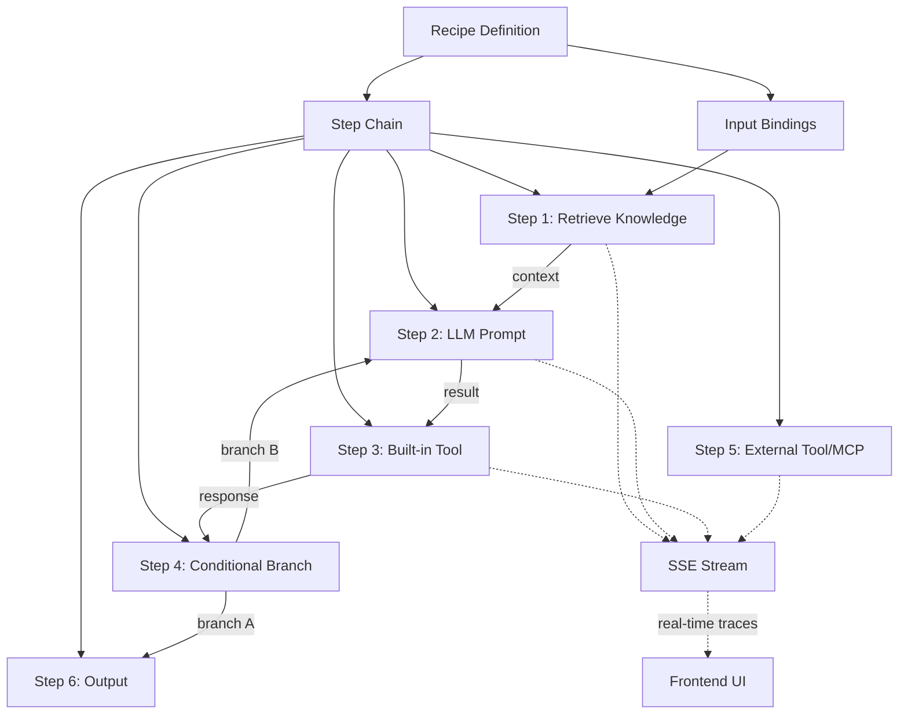

# Recipe Engine — Reusable Knowledge Automation Workflows

A **Recipe** is a saved, reusable sequence of steps that orchestrates memory/knowledge retrieval, LLM prompts, built-in tools, external API calls, and reasoning — producing a deterministic outcome from configurable inputs. Execution streams **real-time reasoning traces** to the UI via SSE.

## Concept Model



Each **Recipe** has:
- **Inputs** — Named parameters (entity_type, entity_id, query, custom variables)
- **Steps** — An ordered list of step definitions, each one of:
  - `retrieve_knowledge` — Semantic/fulltext search across memory tiers
  - `llm_prompt` — Call an LLM with a templated prompt (supports `{{step.N.output}}` variable injection)
  - `builtin_tool` — Execute a built-in platform tool (create_task_list, write_memory, create_insight, etc.)
  - `tool_call` — Call an external API, MCP server, or HTTP endpoint
  - `condition` — Branch based on a JSONPath expression on a previous step's output
  - `transform` — Extract, map, or reshape data (JSONPath, regex, template)
  - `output` — Return a value, write to memory, or fire a webhook
- **Outputs** — The final result(s) of the recipe execution

Each **Recipe Run** is an execution instance with full step-by-step reasoning traces, timing, and status tracking — streamed live via SSE.

---

## User Review Required

> [!IMPORTANT]
> **MCP / External Tool Calls**: The initial implementation will support HTTP-based tool calls (REST APIs, webhooks). Full MCP protocol integration (stdio transport, SSE) can be added as a Phase 2 extension. Is this acceptable for v1?

> [!WARNING]
> **Security**: Tool/MCP steps that make outbound HTTP calls will need allowlisting or admin approval. The initial implementation will restrict tool calls to admin-authenticated users only.

---

## Proposed Changes

### Database Schema — New Tables

#### [MODIFY] [memory_db.py](file:///c:/Users/drmoy/OneDrive%20-%20studygram.me/VsCode/masteragent/backend/memory_db.py)

Add two new tables to the memory schema:

**`recipes`** — Recipe definitions (the saved sequences)
```sql
CREATE TABLE IF NOT EXISTS recipes (
    id              TEXT PRIMARY KEY DEFAULT gen_random_uuid()::text,
    name            TEXT NOT NULL,
    description     TEXT,
    icon            TEXT DEFAULT '🧪',
    category        TEXT DEFAULT 'general',
    input_schema    JSONB DEFAULT '[]',        -- [{name, type, required, default, description}]
    steps           JSONB NOT NULL DEFAULT '[]', -- ordered step definitions
    output_schema   JSONB DEFAULT '{}',        -- expected output shape
    is_active       BOOLEAN DEFAULT TRUE,
    created_by      TEXT DEFAULT 'admin',
    tags            TEXT[] DEFAULT '{}',
    created_at      TIMESTAMPTZ DEFAULT NOW(),
    updated_at      TIMESTAMPTZ DEFAULT NOW()
);
```

**`recipe_runs`** — Execution history (includes full reasoning trace)
```sql
CREATE TABLE IF NOT EXISTS recipe_runs (
    id              TEXT PRIMARY KEY DEFAULT gen_random_uuid()::text,
    recipe_id       TEXT NOT NULL REFERENCES recipes(id) ON DELETE CASCADE,
    status          TEXT DEFAULT 'pending',     -- pending | running | completed | failed | cancelled
    inputs          JSONB DEFAULT '{}',         -- actual input values
    step_results    JSONB DEFAULT '[]',         -- [{step_index, step_name, step_type, status, output, reasoning_trace, error, duration_ms, started_at}]
    final_output    JSONB,                      -- the recipe's return value
    error           TEXT,
    started_at      TIMESTAMPTZ,
    completed_at    TIMESTAMPTZ,
    created_at      TIMESTAMPTZ DEFAULT NOW()
);
CREATE INDEX IF NOT EXISTS idx_recipe_runs_recipe ON recipe_runs (recipe_id);
CREATE INDEX IF NOT EXISTS idx_recipe_runs_status ON recipe_runs (status);
```

---

### Backend — Recipe Router

#### [NEW] [recipes.py](file:///c:/Users/drmoy/OneDrive%20-%20studygram.me/VsCode/masteragent/backend/memory/recipes.py)

New FastAPI router under `/api/memory/recipes/*` with admin JWT auth:

| Method | Endpoint | Description |
|--------|----------|-------------|
| `GET` | `/recipes` | List all recipes (filterable by category, tags) |
| `POST` | `/recipes` | Create a new recipe |
| `GET` | `/recipes/{id}` | Get recipe detail |
| `PUT` | `/recipes/{id}` | Update recipe definition |
| `DELETE` | `/recipes/{id}` | Delete recipe |
| `POST` | `/recipes/{id}/run` | Execute a recipe — returns run_id + starts SSE stream |
| `GET` | `/recipes/{id}/runs` | List execution history for a recipe |
| `GET` | `/recipes/runs/{run_id}` | Get detailed run status + step results |
| `GET` | `/recipes/runs/{run_id}/stream` | **SSE endpoint** — real-time step trace stream |
| `POST` | `/recipes/{id}/duplicate` | Clone a recipe |
| `GET` | `/recipes/tools` | List all available built-in tools |

---

### Backend — SSE Streaming Architecture

#### SSE Stream Design (in [recipes.py](file:///c:/Users/drmoy/OneDrive%20-%20studygram.me/VsCode/masteragent/backend/memory/recipes.py))

The `/run` endpoint returns `{ run_id }` immediately. The frontend then opens an SSE connection to `/stream`:

```python
@router.get("/recipes/runs/{run_id}/stream")
async def stream_recipe_run(run_id: str, admin=Depends(require_admin_auth)):
    """SSE endpoint streaming real-time reasoning traces for a recipe run."""
    
    async def event_generator():
        # Subscribe to Redis pub/sub channel: f"recipe_run:{run_id}"
        async for message in redis_subscriber:
            event = json.loads(message)
            yield {
                "event": event["type"],  # step_started | step_reasoning | step_completed | step_failed | run_completed
                "data": json.dumps(event)
            }
    
    return EventSourceResponse(event_generator())
```

**SSE Event Types:**

| Event | Payload | When |
|-------|---------|------|
| `step_started` | `{step_index, step_name, step_type}` | Step execution begins |
| `step_reasoning` | `{step_index, trace}` | Mid-step reasoning (e.g., LLM thinking, query being run) |
| `step_completed` | `{step_index, output, duration_ms}` | Step finishes successfully |
| `step_failed` | `{step_index, error}` | Step fails |
| `run_completed` | `{final_output, total_duration_ms}` | All steps done |
| `run_failed` | `{error, failed_step_index}` | Recipe execution failed |

**Transport**: The `RecipeEngine` publishes events to a Redis pub/sub channel `recipe_run:{run_id}`. The SSE endpoint subscribes to this channel and forwards events to the client.

---

### Backend — Built-in Tools System

#### [NEW] [recipe_tools.py](file:///c:/Users/drmoy/OneDrive%20-%20studygram.me/VsCode/masteragent/backend/services/recipe_tools.py)

A registry of platform-native tools that recipes can invoke via the `builtin_tool` step type:

```python
BUILTIN_TOOLS = {
    "create_task_list": {
        "name": "Create Task List",
        "description": "Create a structured task list from LLM output",
        "icon": "📋",
        "input_schema": {
            "title": {"type": "string", "required": True},
            "items": {"type": "array", "required": True, "description": "List of task strings or {task, priority, due_date} objects"},
            "entity_type": {"type": "string", "required": False},
            "entity_id": {"type": "string", "required": False},
        },
    },
    "write_memory": {
        "name": "Write Memory",
        "description": "Persist a new memory record for an entity",
        "icon": "🧠",
        "input_schema": {
            "entity_type": {"type": "string", "required": True},
            "entity_id": {"type": "string", "required": True},
            "content_summary": {"type": "string", "required": True},
        },
    },
    "create_insight": {
        "name": "Create Insight",
        "description": "Create a new insight record for an entity",
        "icon": "💡",
        "input_schema": {
            "entity_type": {"type": "string", "required": True},
            "entity_id": {"type": "string", "required": True},
            "name": {"type": "string", "required": True},
            "content": {"type": "string", "required": True},
            "insight_type": {"type": "string", "required": False, "default": "recipe_generated"},
        },
    },
    "create_lesson": {
        "name": "Create Lesson",
        "description": "Create a new shared lesson from recipe output",
        "icon": "🎓",
        "input_schema": {
            "name": {"type": "string", "required": True},
            "content": {"type": "string", "required": True},
            "lesson_type": {"type": "string", "required": False, "default": "process"},
            "tags": {"type": "array", "required": False, "default": []},
        },
    },
    "send_notification": {
        "name": "Send Notification",
        "description": "Fire an outbound webhook or notification",
        "icon": "🔔",
        "input_schema": {
            "url": {"type": "string", "required": True},
            "payload": {"type": "object", "required": True},
            "method": {"type": "string", "required": False, "default": "POST"},
        },
    },
    "search_knowledge": {
        "name": "Search Knowledge",
        "description": "Semantic search across all memory tiers (shorthand for retrieve_knowledge)",
        "icon": "🔍",
        "input_schema": {
            "query": {"type": "string", "required": True},
            "layers": {"type": "array", "required": False, "default": ["memories", "insights", "lessons"]},
            "limit": {"type": "number", "required": False, "default": 10},
        },
    },
}
```

Each built-in tool has an `execute(params, context)` handler that directly interacts with the MasterAgent database/services — no HTTP overhead.

---

### Backend — Recipe Execution Engine  

#### [NEW] [recipe_engine.py](file:///c:/Users/drmoy/OneDrive%20-%20studygram.me/VsCode/masteragent/backend/services/recipe_engine.py)

The core orchestration engine that executes a recipe's step chain with SSE trace streaming:

```python
class RecipeEngine:
    """Executes a recipe step-by-step, streaming reasoning traces via Redis pub/sub."""
    
    def __init__(self, run_id: str):
        self.run_id = run_id
        self.channel = f"recipe_run:{run_id}"
    
    async def execute(self, recipe: dict, inputs: dict) -> dict:
        """Run all steps sequentially, publishing traces per-step."""
        
    async def _execute_step(self, step: dict, context: StepContext) -> StepResult:
        """Dispatch to the appropriate step handler."""
        
    async def _emit(self, event_type: str, data: dict):
        """Publish a trace event to Redis pub/sub."""
        
    # Step handlers:
    async def _step_retrieve_knowledge(self, step, context) -> StepResult
    async def _step_llm_prompt(self, step, context) -> StepResult
    async def _step_builtin_tool(self, step, context) -> StepResult
    async def _step_tool_call(self, step, context) -> StepResult
    async def _step_condition(self, step, context) -> StepResult
    async def _step_transform(self, step, context) -> StepResult
    async def _step_output(self, step, context) -> StepResult
```

**Step Context Threading**: Each step receives the full `context` dict which includes:
- `inputs` — Original recipe inputs
- `steps` — Dict of `{step_index: StepResult}` for all completed steps
- Dynamic variable resolution: `{{inputs.entity_id}}`, `{{steps.0.output}}`, `{{steps.1.output.name}}`

**Reasoning Trace per Step**: Each step handler emits granular reasoning traces:
- `retrieve_knowledge` → "Searching 3 layers for 'entity query'…" → "Found 12 memories, 3 insights"
- `llm_prompt` → "Sending prompt (2,340 tokens) to gpt-4o-mini…" → "Received 890 token response"
- `builtin_tool` → "Executing create_task_list with 5 items…" → "Task list created (id: abc-123)"
- `condition` → "Evaluating: steps.1.output.risk_level == 'high'" → "Result: true → branching to step 4"

**Step Types Detail**:

| Step Type | Config | What It Does |
|-----------|--------|--------------|
| `retrieve_knowledge` | `{layers, query_template, entity_type, entity_id, limit}` | Runs semantic/fulltext search across memory tiers |
| `llm_prompt` | `{prompt_template, system_prompt, model, max_tokens, task_type}` | Calls LLM with variable-injected prompt |
| `builtin_tool` | `{tool_name, params}` | Executes a registered platform tool |
| `tool_call` | `{url, method, headers, body_template, timeout}` | Makes HTTP request to external API/MCP |
| `condition` | `{expression, if_true_step, if_false_step}` | Evaluates expression, jumps to step |
| `transform` | `{input_ref, operation, template}` | Extract/reshape data (jsonpath, regex, template) |
| `output` | `{value_template, write_to_memory?, webhook_url?}` | Produce final output, optionally persist |

---

### Backend — Pydantic Models

#### [MODIFY] [memory_models.py](file:///c:/Users/drmoy/OneDrive%20-%20studygram.me/VsCode/masteragent/backend/memory_models.py)

Add Recipe and RecipeRun Pydantic models:
- `RecipeCreate`, `RecipeUpdate`, `RecipeResponse`
- `RecipeRunResponse`, `RecipeStepResult`
- `RecipeStepDefinition` (discriminated union for step types)
- `RecipeInputSpec` (input parameter schema)
- `BuiltinToolInfo` (tool registry response model)

---

### Backend — Queue Integration

#### [MODIFY] [queue.py](file:///c:/Users/drmoy/OneDrive%20-%20studygram.me/VsCode/masteragent/backend/memory/queue.py)

- Add `recipes_queue = Queue("recipe_ops", ...)` 
- Add `recipes_worker` with concurrency=1 (sequential execution)
- Handle `execute_recipe` job type → instantiates `RecipeEngine` and calls `execute()`
- Wire Redis pub/sub for SSE streaming

---

### Backend — Router Registration

#### [MODIFY] [__init__.py](file:///c:/Users/drmoy/OneDrive%20-%20studygram.me/VsCode/masteragent/backend/memory/__init__.py)

Register the new recipes router:
```python
from memory.recipes import router as recipes_router
memory_router.include_router(recipes_router, include_in_schema=False)
```

---

### Backend — Dependencies

#### [MODIFY] [requirements.txt](file:///c:/Users/drmoy/OneDrive%20-%20studygram.me/VsCode/masteragent/backend/requirements.txt)

Add SSE support:
```
sse-starlette>=1.6.0
```

---

### Frontend — API Client

#### [MODIFY] [api.js](file:///c:/Users/drmoy/OneDrive%20-%20studygram.me/VsCode/masteragent/frontend/src/lib/api.js)

Add recipe API functions:
```js
// Recipes
export const getRecipes = (params) => api.get('/memory/recipes', { params });
export const getRecipe = (id) => api.get(`/memory/recipes/${id}`);
export const createRecipe = (data) => api.post('/memory/recipes', data);
export const updateRecipe = (id, data) => api.put(`/memory/recipes/${id}`, data);
export const deleteRecipe = (id) => api.delete(`/memory/recipes/${id}`);
export const runRecipe = (id, data) => api.post(`/memory/recipes/${id}/run`, data);
export const getRecipeRuns = (id, params) => api.get(`/memory/recipes/${id}/runs`, { params });
export const getRecipeRunDetail = (runId) => api.get(`/memory/recipes/runs/${runId}`);
export const duplicateRecipe = (id) => api.post(`/memory/recipes/${id}/duplicate`);
export const getBuiltinTools = () => api.get('/memory/recipes/tools');

// SSE stream helper (not via axios — uses native EventSource)
export const createRecipeRunStream = (runId) => {
    const token = localStorage.getItem('auth_token');
    return new EventSource(`${API_BASE}/memory/recipes/runs/${runId}/stream?token=${token}`);
};
```

---

### Frontend — Recipe Builder Page

#### [NEW] [RecipesPage.jsx](file:///c:/Users/drmoy/OneDrive%20-%20studygram.me/VsCode/masteragent/frontend/src/pages/RecipesPage.jsx)

Full-page recipe management UI with:

1. **Recipe Library** (left panel) — List of saved recipes with search, category filter, and "New Recipe" button
2. **Recipe Builder** (main panel) — Visual step editor with:
   - Drag-and-drop step ordering
   - Step type selector (retrieve, prompt, builtin_tool, tool_call, condition, transform, output)
   - Per-step configuration forms with live variable autocomplete (`{{inputs.x}}`, `{{steps.N.output}}`)
   - Input schema editor (define recipe parameters)
   - Recipe metadata (name, description, icon, category, tags)
   - Built-in tool picker with parameter forms
3. **Execution Panel** (right drawer / bottom panel) — with:
   - Input form (auto-generated from recipe's `input_schema`)
   - **Live Reasoning Trace** — Real-time SSE-driven step-by-step execution visualization:
     - Animated step indicators (pending → running → completed/failed)
     - Expanding trace cards showing what each step is doing
     - Token counts, latency, and intermediate outputs
     - Error details with stack traces for failed steps
   - Final output display (markdown rendered)
4. **Run History** — Timeline of past executions with expandable step details, filterable by status

#### Reasoning Trace UI Design

The trace panel renders each step as an expandable card:

```
┌────────────────────────────────────────────────┐
│ ✅ Step 1: Fetch Recent Memories     [1.2s]    │
│   ├─ 🔍 Searching memories, insights           │
│   ├─ 📊 Found 8 memories, 2 insights           │
│   └─ 📄 Output: [expandable preview]           │
├────────────────────────────────────────────────┤
│ ⏳ Step 2: Generate Summary         [running]  │
│   ├─ 🤖 Sending 2,340 tokens to gpt-4o-mini   │
│   └─ ⏳ Waiting for response...                │
├────────────────────────────────────────────────┤
│ ○  Step 3: Create Task List          [pending]  │
├────────────────────────────────────────────────┤
│ ○  Step 4: Return Brief              [pending]  │
└────────────────────────────────────────────────┘
```

---

### Frontend — Route Registration

#### [MODIFY] [App.js](file:///c:/Users/drmoy/OneDrive%20-%20studygram.me/VsCode/masteragent/frontend/src/App.js)

Add route: `<Route path="recipes" element={<RecipesPage />} />`

---

## Step Definition Schema (JSON)

Example recipe — "Weekly Entity Summary with Task List":
```json
{
  "name": "Weekly Entity Summary",
  "description": "Generate a weekly intelligence brief + action items for any entity",
  "icon": "📊",
  "category": "reporting",
  "input_schema": [
    {"name": "entity_type", "type": "string", "required": true, "description": "Entity category"},
    {"name": "entity_id", "type": "string", "required": true, "description": "Entity identifier"},
    {"name": "days_back", "type": "number", "required": false, "default": 7}
  ],
  "steps": [
    {
      "type": "retrieve_knowledge",
      "name": "Fetch Recent Memories",
      "config": {
        "layers": ["memories", "insights"],
        "query_template": "Recent activity for {{inputs.entity_type}} {{inputs.entity_id}}",
        "entity_type": "{{inputs.entity_type}}",
        "entity_id": "{{inputs.entity_id}}",
        "limit": 20
      }
    },
    {
      "type": "llm_prompt",
      "name": "Generate Summary + Actions",
      "config": {
        "system_prompt": "You are an intelligence analyst. Write a concise weekly brief with action items. Return JSON: {\"summary\": \"...\", \"action_items\": [{\"task\": \"...\", \"priority\": \"high|medium|low\"}]}",
        "prompt_template": "Based on the following memories and insights for {{inputs.entity_type}} {{inputs.entity_id}}:\n\n{{steps.0.output}}\n\nWrite a structured weekly summary and extract action items.",
        "max_tokens": 2000,
        "task_type": "summarization"
      }
    },
    {
      "type": "transform",
      "name": "Extract Action Items",
      "config": {
        "input_ref": "{{steps.1.output}}",
        "operation": "jsonpath",
        "template": "$.action_items"
      }
    },
    {
      "type": "builtin_tool",
      "name": "Create Follow-up Tasks",
      "config": {
        "tool_name": "create_task_list",
        "params": {
          "title": "Weekly Actions: {{inputs.entity_type}} / {{inputs.entity_id}}",
          "items": "{{steps.2.output}}",
          "entity_type": "{{inputs.entity_type}}",
          "entity_id": "{{inputs.entity_id}}"
        }
      }
    },
    {
      "type": "output",
      "name": "Return Brief",
      "config": {
        "value_template": {"summary": "{{steps.1.output.summary}}", "task_list_id": "{{steps.3.output.id}}"}
      }
    }
  ]
}
```

---

## Built-in Tools Registry (v1)

| Tool | Description | Input | Output |
|------|-------------|-------|--------|
| `create_task_list` | Create structured task list from recipe output | `{title, items[], entity_type?, entity_id?}` | `{id, task_count}` |
| `write_memory` | Persist a new memory record | `{entity_type, entity_id, content_summary}` | `{memory_id}` |
| `create_insight` | Create insight for an entity | `{entity_type, entity_id, name, content, insight_type?}` | `{insight_id}` |
| `create_lesson` | Create a shared lesson | `{name, content, lesson_type?, tags?}` | `{lesson_id}` |
| `send_notification` | Fire outbound webhook/notification | `{url, payload, method?}` | `{status_code, response}` |
| `search_knowledge` | Semantic search across memory tiers | `{query, layers?, limit?}` | `{results[]}` |

> [!TIP]
> More built-in tools can be registered by dropping new entries into `BUILTIN_TOOLS` in `recipe_tools.py`. The tool picker in the UI auto-discovers available tools via `GET /recipes/tools`.

---

## Open Questions

> [!IMPORTANT]
> 1. **Looping**: Should we support explicit loop steps (e.g., "for each entity in list, run steps 2-4")? This adds complexity but enables batch processing recipes. Could be Phase 2.

> [!IMPORTANT]
> 2. **Recipe Sharing**: Should recipes be exportable/importable as JSON files? This would allow a recipe marketplace/community sharing model.

> [!IMPORTANT]
> 3. **Navigation**: Where should "Recipes" live in the sidebar? I suggest as a new top-level item under the Memory section (alongside Explorer and Monitor), with a beaker/flask icon 🧪.

> [!IMPORTANT]
> 4. **Task Lists Storage**: The `create_task_list` tool needs a backing store. Should we add a new `recipe_task_lists` table, or store task lists as a special interaction type within the existing memory architecture?

---

## Verification Plan

### Automated Tests
```powershell
# After implementation, run against local server:
cd backend/tests
$env:MEMORY_TEST_BASE_URL="http://localhost:8084"
python -m pytest . -v --timeout=30
```

- CRUD tests for recipe creation, update, delete
- Execution tests with a simple 2-step recipe (retrieve → prompt)
- Variable injection tests (inputs, step references)
- Built-in tool execution tests (create_task_list, write_memory)
- SSE streaming tests (event order, completeness)
- Error handling tests (failed LLM call, invalid step type, tool timeout)

### Manual Verification
- Create a recipe in the UI builder
- Execute it with sample inputs and observe live reasoning traces
- Verify SSE stream delivers all step events in real-time
- Test built-in tool execution (create task list from LLM output)
- Test drag-and-drop reordering
- Test recipe duplication
- Browser recording of the full flow
