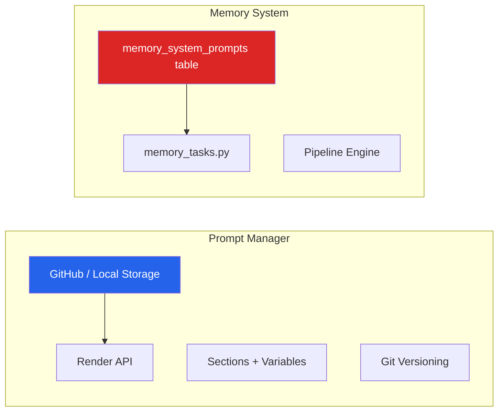
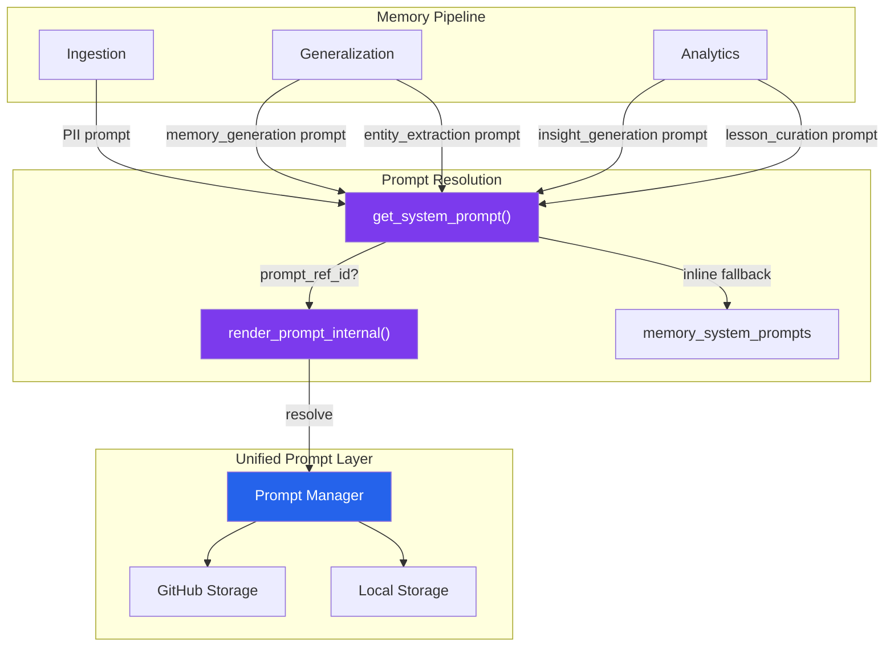

# Prompts × Memory Convergence — Vision & Integration Analysis

This document explores how the two currently independent MasterAgent modules — the **Prompt Manager** and the **Memory System** — can converge into a unified platform.

## Current State: Two Isolated Worlds



**The disconnect:** The Memory System stores its own system prompts in `memory_system_prompts` (PostgreSQL) as plain text blobs. It has zero awareness of the Prompt Manager. This means:

- Memory system prompts are **unversioned** — no history, no rollback
- Memory prompts get **no variable injection** — the `{{entity_type}}`, `{{date}}` context is built manually in Python string formatting
- There's **no reuse** — a prompt template crafted in the Prompt Manager can't be referenced by the Memory pipeline
- **No A/B testing** — can't compare memory generation quality between prompt versions

---

## Integration Vector 1: Prompt Manager → Memory Pipeline

### Concept: Prompt References Instead of Inline Text

Instead of storing prompt text directly in `memory_system_prompts`, the Memory System would reference a Prompt Manager prompt by `(prompt_id, version)`. At runtime, `get_system_prompt()` resolves through the Prompt Manager's render pipeline.

### How It Works Today (isolated)

```python
# config_helpers.py — current
def get_system_prompt(prompt_type: str) -> Optional[str]:
    cursor.execute("""
        SELECT prompt_text FROM memory_system_prompts
        WHERE prompt_type = %s AND is_active = TRUE
    """, (prompt_type,))
    row = cursor.fetchone()
    return row["prompt_text"] if row else None

# memory_tasks.py — current usage
system_prompt = get_system_prompt("memory_generation") or DEFAULT_MEMORY_PROMPT
content_summary = await call_llm(llm_context[:10000], system_prompt=system_prompt)
```

### How It Would Work (integrated)

```python
# config_helpers.py — proposed
def get_system_prompt(prompt_type: str, variables: dict = None) -> Optional[str]:
    cursor.execute("""
        SELECT prompt_text, prompt_ref_id, prompt_ref_version 
        FROM memory_system_prompts
        WHERE prompt_type = %s AND is_active = TRUE
    """, (prompt_type,))
    row = cursor.fetchone()
    if not row:
        return None
    
    # If linked to Prompt Manager → resolve through render pipeline
    if row["prompt_ref_id"]:
        return render_prompt_internal(
            prompt_id=row["prompt_ref_id"],
            version=row["prompt_ref_version"] or "main",
            variables=variables or {}
        )
    
    # Fallback: plain text (backward compatible)
    return row["prompt_text"]
```

```python
# memory_tasks.py — proposed usage
system_prompt = get_system_prompt("memory_generation", variables={
    "entity_type": entity_type,
    "entity_id": entity_id,
    "date": interaction_date,
    "interaction_count": str(len(interactions)),
    "mode": mode,
})
```

### What This Unlocks

| Capability | Before | After |
|---|---|---|
| **Versioned prompts** | No history | Full Git history, branch per experiment |
| **Variable injection** | Manual Python f-strings | `{{entity_type}}`, `{{date}}` via render pipeline |
| **Sectioned prompts** | One monolithic string | Multi-section: rules + persona + output_format |
| **A/B testing** | Impossible | Switch memory generation from `v1` → `v2` in one click |
| **Cross-module reuse** | Duplicated text | One "memory_generation" prompt used by API consumers AND the pipeline |
| **Tiptap editing (future)** | Plain textarea | Rich editor with variable chips, formatting |

### Schema Change

```sql
ALTER TABLE memory_system_prompts 
    ADD COLUMN IF NOT EXISTS prompt_ref_id TEXT,      -- FK to prompts.id
    ADD COLUMN IF NOT EXISTS prompt_ref_version TEXT;  -- Git branch name
```

### UI/UX in Memory Settings

In each pipeline sub-tab (Ingestion, Generalization, Analytics), the prompt editor card would have two modes:

```
┌─────────────────────────────────────────────────────┐
│ 📝 Memory Generation Prompt                         │
│                                                     │
│ Source: ○ Inline (edit below)  ● Linked Prompt       │
│                                                     │
│ ┌── When "Linked Prompt" ──────────────────────────┐│
│ │ Prompt: [memory-generator       ▾]  v: [main ▾]  ││
│ │ Preview: "You are an AI memory system..."         ││
│ │ [Open in Prompt Editor ↗]                         ││
│ └───────────────────────────────────────────────────┘│
│                                                     │
│ ┌── When "Inline" ─────────────────────────────────┐│
│ │ [textarea with prompt text]                       ││
│ └───────────────────────────────────────────────────┘│
└─────────────────────────────────────────────────────┘
```

### Built-in Variables the Memory Pipeline Would Expose

When using a Linked Prompt, the Memory pipeline pre-fills these variables automatically:

| Variable | Source | Available In |
|---|---|---|
| `{{entity_type}}` | Pipeline context | All prompts |
| `{{entity_id}}` | Pipeline context | All prompts |
| `{{date}}` | Pipeline context | memory_generation |
| `{{interaction_count}}` | Pipeline context | memory_generation |
| `{{mode}}` | memory_settings | memory_generation |
| `{{prior_context}}` | Prior memory fetch | memory_generation |
| `{{raw_interactions}}` | Interaction text | memory_generation |
| `{{ner_signals}}` | NER output | memory_generation |
| `{{insight_count}}` | DB query | insight_generation |

The user would see these in the Prompt Editor as pre-registered variables, injected at render time.

---

## Integration Vector 2: GitHub Versioning → Memory System

### Where GitHub Versioning Could Add Value

GitHub versioning in the Prompt Manager works because **prompts are authored artifacts** — text that humans iterate on. The question is: what in the Memory System is also an "authored artifact"?

#### ✅ Strong Use Cases

**1. Pipeline Configuration Versioning**

As we build the Visual Pipeline Modeler, the configuration itself becomes a critical artifact. Think of it as "infrastructure as code" for your AI memory:

```
memory-config/
├── main/                          # Production config
│   ├── pipeline.json              # Full pipeline schema
│   ├── ingestion.json             # PII + embedding settings
│   ├── generalization.json        # NER + summarization settings
│   └── analytics.json             # Insight + lesson rules
└── experiment-aggressive-ner/     # Experimental branch
    └── generalization.json        # NER threshold → 0.3 instead of 0.5
```

**Value**: Roll back a pipeline config change that degraded memory quality. Compare experiment branches. Audit who changed what and when.

**2. System Prompt Versioning (solved by Vector 1)**

If memory system prompts are linked to Prompt Manager prompts, they inherit Git versioning for free. No additional work needed.

**3. NER Schema Versioning**

The `ner_schema` field in `memory_entity_type_config` defines what entity classes to extract. This is a structured artifact that evolves:

```json
// v1: Basic
["Person", "Company", "Product"]

// v2: Enriched
["Person", "Company", "Product", "Emotion_State", "Decision", "Deadline"]
```

Versioning lets you experiment with richer NER schemas without losing the working config.

#### ⚠️ Moderate Use Cases

**4. Lesson Library Export**

Lessons (Tier 3) are de-identified, shareable knowledge. They could be exported to a GitHub repo as a versioned knowledge base:

```
lessons/
├── process/
│   ├── onboarding-friction-points.md
│   └── follow-up-timing-patterns.md
├── risk/
│   └── late-payment-predictors.md
└── sales/
    └── demo-conversion-signals.md
```

**Value**: Team-shareable, version-tracked institutional knowledge. Could be consumed by other AI agents or documentation systems.

**5. Memory Audit Trail**

Not real-time memory content (that's ephemeral/high-volume), but **snapshots** — periodic exports of entity memory state for compliance or handoff:

```
entity-snapshots/
├── contacts/
│   ├── john-doe-2026-Q1.md     # Quarterly memory digest
│   └── john-doe-2026-Q2.md
```

#### ❌ Poor Fit

**6. Raw Interactions / Daily Memories**: Too high-volume, too ephemeral for Git. Already well-served by PostgreSQL + pgvector.

**7. Real-time Embeddings**: Binary vector data — Git can't diff or review this meaningfully.

### Implementation Approach for Config Versioning

Rather than building a second Git integration, the **Prompt Manager's storage layer already exists**. The config could be stored as a "prompt" with sections:

```
Pipeline Config as a Prompt:
├── Prompt: "memory-pipeline-config"
│   ├── Section: ingestion.json
│   ├── Section: generalization.json  
│   └── Section: analytics.json
│
├── Version: main (production)
├── Version: experiment-1
└── Version: experiment-2
```

This is unconventional but means zero new infrastructure — the Prompt Manager's GitHub integration, versioning, diff UI, and API all work out of the box. The Memory pipeline reads its active config via the Render API with the active version.

---

## Convergence Roadmap

### Phase 1: Prompt Linking (Near-term — with Pipeline Modeler)

- Add `prompt_ref_id` + `prompt_ref_version` cols to `memory_system_prompts`
- Build "Inline vs Linked" toggle in Memory Settings prompt cards
- Implement `render_prompt_internal()` (same-process, no HTTP) for fast resolution
- Pre-register pipeline context variables in linked prompts
- **No breaking changes** — inline text remains the default, linking is opt-in

### Phase 2: Config Versioning (Medium-term)

- Store pipeline config as a managed prompt (or introduce a dedicated `configs` entity type in the Prompt Manager)
- Add version selector to Memory Settings: *"Active Config: main ▾"*
- Add diff view to compare config versions
- One-click rollback if a config change degrades quality

### Phase 3: Lesson Export (Future)

- Scheduled or manual export of lessons to a GitHub repo
- Markdown format, organized by lesson_type
- Could feed into documentation sites, onboarding materials, or other agents

### Phase 4: Tiptap Editor (Future)

- Replace plain textareas with Tiptap for prompt editing
- Variable chips (inline `{{entity_type}}` rendered as interactive tokens)
- Shared between Prompt Manager and Memory Settings inline editors
- Only worth doing once both systems share the same prompt format

---

## Architecture Diagram: Converged State



## Open Questions

1. **Config entity type**: Should pipeline configs live in the Prompt Manager as a special "config" type, or should we build a lightweight separate versioning mechanism? The Prompt Manager approach is zero-infra but conceptually a stretch.

2. **Render performance**: `render_prompt_internal()` needs to be fast (~5ms). The current render endpoint does a GitHub API call per section. For same-process resolution, we'd need a cached local read path. The `LocalStorageService` already supports this.

3. **Variable scope**: When a prompt is used by both the API (external agents) and the Memory pipeline, should pipeline-specific variables (like `{{prior_context}}`) be hidden from the API consumers? Or documented as "auto-populated when used by the pipeline"?
