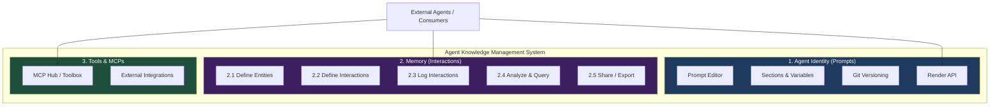
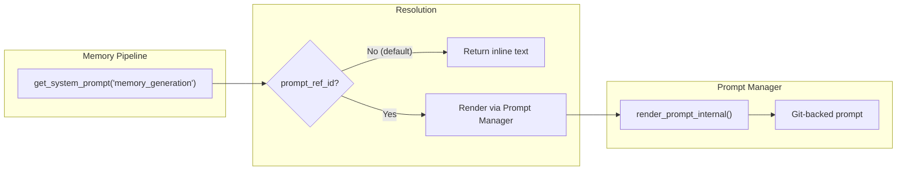

# MasterAgent: Agent Knowledge Management System

## Product Architecture

MasterAgent is an **Agent Knowledge Management System** — the infrastructure layer that gives AI agents identity, memory, and tools.



---

## Layer 1: Agent Identity Management System (Prompts)

**Purpose**: Define *who the agent is* — its persona, instructions, rules, and behavioral constraints.

**What it is**: A versioned prompt editor with Git-backed storage. External consumers use the Render API to fetch compiled agent instructions at runtime.

**Current implementation**:
| Component | Location |
|---|---|
| Prompt CRUD + sections | `routes/prompts.py` |
| Render API (variable injection) | `routes/render.py` |
| GitHub storage | `storage_service.py` → `GitHubStorageService` |
| Local storage fallback | `storage_service.py` → `LocalStorageService` |
| Frontend editor | `PromptEditorPage.jsx` |
| Variable management | `VariablesPanel.jsx`, `VariableAutocomplete.jsx` |

**Key characteristics**:
- Git-versioned (branches = prompt versions)
- Section-based composition
- `{{variable}}` injection at render time
- API key auth for external consumers
- The prompts DB (`prompts`, `prompt_variables`) lives in the core PostgreSQL schema

---

## Layer 2: Memory System (Interactions)

**Purpose**: Define *what the agent knows* — structured knowledge extracted from real-world interactions, organized into a 4-tier hierarchy.

### 2.1 Define Entities

Define the objects the system tracks. Each entity type has:
- **Name** (e.g., "contact", "institution", "product")
- **Type classification** (+ subtypes: lead, client, partner...)
- **Description**
- **Custom variables / metadata fields** (via `metadata_field_map`)

**Current implementation**: `memory_entity_types`, `memory_entity_subtypes`, `memory_entity_type_config` tables. Managed in `KnowledgeModelSettings.jsx`.

### 2.2 Define Interactions

Define the channels and types of interactions the system accepts:
- Channel types (email, WhatsApp, call, webhook, etc.)
- Interaction type rules
- Webhook source configurations with HMAC validation
- Per-source metadata field mapping

**Current implementation**: `memory_channel_types`, `memory_webhook_sources` tables.

### 2.3 Log Interactions

Ingest raw interaction data via API or webhooks:
- REST API: `POST /api/memory/interactions`
- Webhooks: `POST /api/memory/webhooks/{source_id}`
- Real-time: attachment parsing (vision), ephemeral embeddings, Redis caching

**Current implementation**: `interactions` table (Tier 0). Ingestion in `memory_tasks.py` → `process_interaction()`.

### 2.4 Analyze & Query

The 4-tier processing pipeline that extracts knowledge from interactions:

```
Tier 0: Interactions (raw log, immutable)
    ↓ NER + PII scrub + LLM summarization
Tier 1: Memories (daily per-entity snapshots)
    ↓ Compaction (threshold-based)
Tier 2: Insights (patterns, risks, opportunities)
    ↓ Lesson mining (accumulation-based)
Tier 3: Lessons (de-identified, shareable knowledge)
```

Plus:
- Semantic search via pgvector
- Entity workspace (chat with entity's memory)
- Admin dashboard & monitoring

**Current implementation**: `memories`, `insights`, `lessons` tables. Pipeline engine in `memory_tasks.py`. Search in `services/search.py`. Workspace in `memory/workspace.py`.

### 2.5 Share / Export

- Lessons are inherently shareable (PII-scrubbed, de-identified)
- Visibility controls (`shared` vs `private`)
- API endpoints for querying lessons across entities
- *Future*: GitHub export of lesson library, bulk export

---

## Layer 3: Tools & MCPs (Future Integration)

**Purpose**: Define *what the agent can do* — external tool access, MCP server connections, and action capabilities.

Partially implemented in a separate project. Integration points:
- Tool definitions / registry
- MCP Hub for managing connected tool servers
- Action execution from within entity workspaces

---

## Integration Seam: Prompts ↔ Memory

The two layers are **separate systems** with a **narrow, well-defined integration point**:

> [!IMPORTANT]
> The Memory System's pipeline uses system prompts (for summarization, NER, insight generation, etc.). These prompts could **optionally reference** a Prompt Manager entry instead of storing inline text. This is the only integration seam.

### How it works



### What each layer owns

| Concern | Owned by |
|---|---|
| Agent persona / instructions | **Prompts** (Layer 1) |
| Prompt versioning & Git storage | **Prompts** (Layer 1) |
| Entity definitions & metadata | **Memory** (Layer 2) |
| Interaction ingestion & processing | **Memory** (Layer 2) |
| Pipeline configuration | **Memory** (Layer 2) |
| System prompts for ML tasks | **Memory** (Layer 2), optionally *referencing* Layer 1 |
| Pipeline config versioning | **Memory** (Layer 2) — own mechanism, not Git |
| NER schemas | **Memory** (Layer 2) |
| Tool definitions & execution | **Tools** (Layer 3) |

### What the integration is NOT

- ❌ Pipeline configs are NOT "special prompts" — they're pipeline concerns
- ❌ The Prompt Manager does NOT need to know about entities, interactions, or memory tiers
- ❌ Memory does NOT need Git versioning for its data — PostgreSQL is the right store
- ❌ The two modules don't share tables or schemas

---

## Current Codebase Mapping

```
backend/
├── core/                   # Shared: DB, auth, storage
├── routes/                 # Layer 1: Prompt Manager endpoints
├── storage_service.py      # Layer 1: GitHub/Local storage
├── memory/                 # Layer 2: Memory routers + logic
├── memory_tasks.py         # Layer 2: Pipeline engine
├── memory_db.py            # Layer 2: Memory schema
├── services/               # Shared: LLM, embeddings, search
└── server.py               # FastAPI mount point

frontend/
├── pages/
│   ├── PromptEditorPage    # Layer 1
│   ├── DashboardPage       # Layer 1
│   ├── TemplatesPage       # Layer 1
│   ├── MemoryExplorerPage  # Layer 2
│   ├── MemoryMonitorPage   # Layer 2
│   └── SettingsPage        # Shared (both layers)
└── components/
    └── settings/
        ├── StorageSettings         # Layer 1
        ├── LLMProviderSettings     # Shared (credentials)
        ├── AccessSettings          # Shared (API keys)
        ├── KnowledgeModelSettings  # Layer 2
        └── MemorySettings (NEW)    # Layer 2 (pipeline modeler)
```

---

## What This Means for the Pipeline Modeler

The Memory Settings multi-tab UI we're building is purely a **Layer 2** concern:

1. **Ingestion tab**: PII config, embedding config, rate limiting + task LLM assignments
2. **Generalization tab**: Schedule, NER config, summarization config + task LLM assignments
3. **Analytics tab**: Insight/lesson rules + task LLM assignments

The **only crossover** with Layer 1 is that each prompt editor card in these tabs could have an "Inline / Linked Prompt" toggle — letting the user optionally point to a Prompt Manager entry instead of editing inline. This is a Phase 2 enhancement, not a blocker for the Pipeline Modeler.
