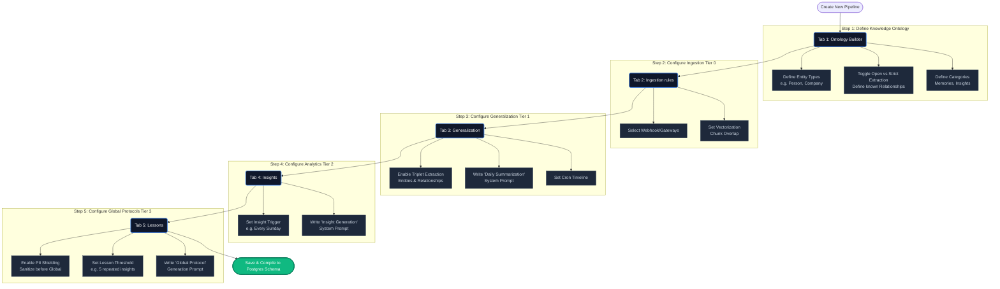

# Visual Memory Pipeline Modeler & Knowledge Schema

Transforming the static "Advanced Settings" page into a flexible, configuration-driven Memory Modeler. This plan addresses the transition from hardcoded pipeline logic to a dynamic, schema-driven approach managed via a Tabbed UI.

## User Journey: Step-by-Step Configuration Flow

Here is the visual mapping of how a Builder will step through the UI to configure a completely custom LLM Memory process:



## User Review Required

> [!IMPORTANT]  
> Are we ready to approve this plan and proceed with executing Phase 1 (Database modeling)?

<hr>

## Proposed Changes

### Phase 1: Database & Data Modeling
We will define a robust JSON schema for the Pipeline Configuration.

#### [NEW] Pipeline Configuration Schema
```json
{
  "pipeline_id": "default",
  "ontology": {
    "entities": ["Person", "Company", "Product", "Feature_Request"],
    "relationships": {
      "mode": "hybrid", // Can be 'strict', 'open', or 'hybrid'
      "defined_types": ["WORKS_FOR", "BOUGHT", "REQUESTED_FEATURE"]
    },
    "asset_types": {
      "memory_types": ["Meeting", "Support_Ticket"],
      "insight_types": ["Churn_Risk", "Upsell_Opportunity"],
      "lesson_types": ["Global_Protocol", "Cultural_Norm"]
    }
  },
  "tier_0_ingestion": {
    "vectorization": { "auto_embed": true, "chunk_size": 400, "chunk_overlap": 80 }
  },
  "tier_1_generalization": {
    "trigger": { "type": "schedule", "cron": "0 2 * * *" },
    "extraction": { 
        "enabled": true, 
        "extract_entities": true, 
        "extract_relationships": true 
    },
    "summarization_prompt": "You are summarizing daily interactions..."
  },
  "tier_2_insights": {
    "insight_sweep_trigger": "every_sunday",
    "insight_generation_prompt": "Review memories and identify patterns..."
  },
  "tier_3_lessons": {
    "lesson_threshold": 5,
    "pii_shielding": { "enabled": true, "provider": "local_regex" },
    "lesson_generation_prompt": "Synthesize a global protocol from..."
  }
}
```

### Phase 2: The Modeler UI (Frontend)
Build the new configuration page using a Tabbed layout directly following the Mermaid diagram structure.

#### [NEW] Configuration Interface Components
- **Tab 1: Knowledge Ontology** 
  - Define custom Entity Types (tags).
  - Define standard Relationships (with a toggle for allowing LLM to 'invent' new ones).
  - Define custom enums for Memories/Insights/Lessons.
- **Tab 2: Ingestion (Tier 0)**
  - Webhook/Gateway triggers and Vectorization settings (Chunking).
- **Tab 3: Generalization (Tier 1)**
  - Toggle Entity/Relationship extraction.
  - **Prompt Editor:** Daily Summarization Prompt editing.
- **Tab 4: Insights (Tier 2)**
  - **Prompt Editor:** Insight Generation Prompt editing.
- **Tab 5: Global Lessons (Tier 3)**
  - **PII Shielding:** Toggles for sanitizing data before it becomes global logic.
  - **Prompt Editor:** Lesson Generation Prompt editing.

### Phase 3: Backend Execution Engine Refactor
- Refactor the existing sequence (e.g., `memory_tasks.py`) to read the prompt strings and configurations directly from the active JSON configuration rather than hardcoded variables.

## Verification Plan
1. **Modeler Data Binding:** Verify that typing into the UI editors accurately updates the Postgres JSON schema payload.
2. **Behavior Change:** Update the Tier 1 summarization prompt via the UI, fire the "Run Now" manual sweep trigger, and verify the LLM utilizes the *newly entered* system prompt.
