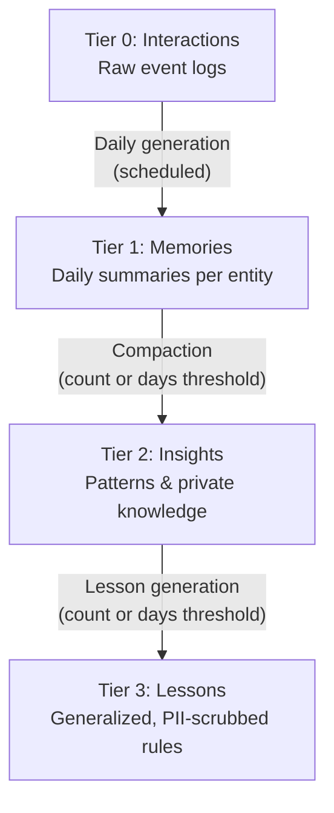
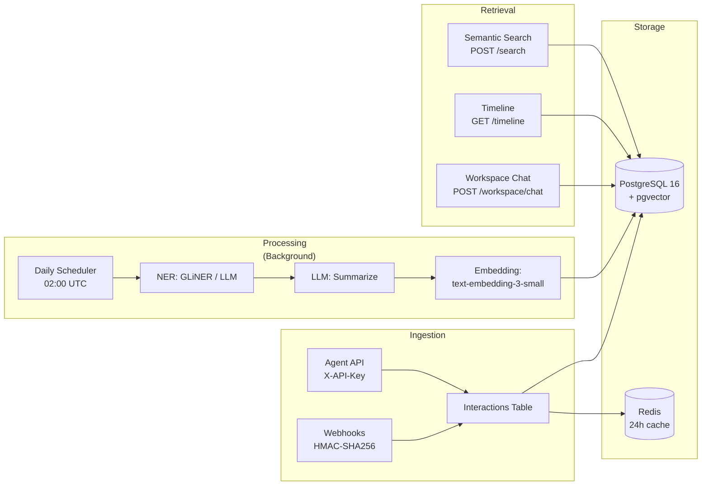

# MasterAgent Memory System — Complete Guide

## What Is It?

The Memory System is **Pillar B** of MasterAgent — a persistent, searchable "brain" for your AI agents. It gives any AI agent the ability to:

1. **Remember** — Log every interaction event (emails, chats, notes, CRM updates) permanently
2. **Distill** — Automatically compress raw events into meaningful daily summaries
3. **Learn** — Discover patterns and insights across interactions with specific entities
4. **Generalize** — Extract universal lessons (PII-scrubbed) that can be shared across all agents

Think of it as a CRM's memory layer, but designed for AI agents instead of humans.

---

## The 4-Tier Data Model

The memory system progressively distills raw data into actionable intelligence:



### Tier 0 — Interactions (Raw Input)
| What | Permanent, immutable log of every event |
|---|---|
| **Created by** | Agents via API (`POST /api/memory/interactions`) or Webhooks |
| **Content** | Raw text, metadata, attachment refs |
| **Key fields** | `content`, `interaction_type`, `primary_entity_type`, `primary_entity_id` |
| **Lifetime** | Never deleted. Status transitions: `pending` → `done` |
| **Cached** | Redis for 24h hot-path access |
| **Embedded?** | ❌ No — interactions are never vectorized |

### Tier 1 — Memories (Daily Summaries)
| What | Distilled daily log per entity |
|---|---|
| **Created by** | Background job (runs daily at configurable time, default 02:00 UTC) |
| **Content** | LLM-generated summary of the day's interactions for one entity |
| **Key fields** | `content_summary`, `related_entities`, `intents`, `interaction_count` |
| **Embedded?** | ✅ Yes — 1536-dim OpenAI vector for semantic search |
| **One per** | Entity + Date (unique constraint) |

### Tier 2 — Insights (Entity-Specific Patterns)
| What | Discovered patterns, risks, or opportunities about a specific entity |
|---|---|
| **Created by** | Compaction job (when N memories accumulate) or manually by admin |
| **Content** | LLM-analyzed pattern from a batch of memories |
| **Status flow** | `draft` → `confirmed` → `archived` |
| **Key fields** | `name`, `insight_type`, `content`, `summary`, `source_memory_ids` |
| **Embedded?** | ✅ Yes |

### Tier 3 — Lessons (Universal Knowledge)
| What | Generalized, PII-scrubbed knowledge applicable across all entities |
|---|---|
| **Created by** | Lesson check job (when N confirmed insights accumulate) or manual promotion |
| **Content** | LLM-generalized, de-identified synthesis of multiple insights |
| **Key fields** | `name`, `lesson_type`, `content`, `summary`, `visibility`, `tags` |
| **Embedded?** | ✅ Yes |
| **Visibility** | `shared` — readable by all agents in the workspace |

---

## How the Pipeline Works

### Step 1: Ingestion

Events enter the system through two channels:

#### A) Agent API (`POST /api/memory/interactions`)
```bash
curl -X POST https://your-domain/api/memory/interactions \
  -H "X-API-Key: mem_abc123..." \
  -H "Content-Type: application/json" \
  -d '{
    "interaction_type": "email",
    "content": "Met with Acme Corp today. They want to expand the contract...",
    "primary_entity_type": "company",
    "primary_entity_id": "acme-corp",
    "source": "crm_agent"
  }'
```

#### B) Webhooks (`POST /api/memory/webhooks/inbound/{source_id}`)
Register a webhook source in the admin UI, then point your CRM/automation tool to the inbound URL. Events are normalized using a configurable `metadata_field_map` (dot-notation for nested payloads).

### Step 2: Daily Memory Generation (Background)

A background loop wakes every 60 seconds and checks if the scheduled time has passed (default 02:00 UTC). If it hasn't run today:

1. **Find pending interactions** from yesterday or older, grouped by entity
2. **NER extraction** — GLiNER (if enabled) or LLM identifies people, organizations, projects
3. **LLM summarization** — Two modes:
   - `ner_only` — Feed only extracted entities/signals to the LLM
   - `ner_and_raw` — Feed raw interaction text + NER output (default, higher quality)
4. **Embedding** — Summary vectorized via `text-embedding-3-small` (1536-dim)
5. **Write Memory** — One row per entity per date (INSERT only, never upserted)
6. **Mark interactions as `done`** and flush from Redis

### Step 3: Compaction → Insights

After each memory generation, the system checks if compaction should trigger. Two trigger modes:

| Trigger | Condition |
|---|---|
| **Count** | Uncompacted memories ≥ `compaction_threshold` (default: 10) |
| **Days** | Oldest uncompacted memory ≥ `insight_trigger_days` AND at least 2 memories exist |

When triggered:
1. Fetch the N oldest uncompacted memories
2. Send to LLM for pattern analysis → structured JSON response
3. Generate embedding for the insight
4. Write insight as `draft` (or `confirmed` if `insight_auto_approve` is enabled)
5. Mark source memories as `compacted = TRUE`

### Step 4: Lessons (Knowledge Accumulation)

Similar trigger pattern — fires when enough confirmed insights have accumulated:

| Trigger | Condition |
|---|---|
| **Count** | Unused confirmed insights ≥ `lesson_threshold` (default: 5) |
| **Days** | Oldest unused insight ≥ `lesson_trigger_days` AND at least 2 exist |

When triggered:
1. **PII scrub** every insight's content
2. Send scrubbed insights to LLM for generalization
3. Generate embedding
4. Write lesson with `visibility: shared`

---

## Architecture Overview



### Key Infrastructure
| Component | Role |
|---|---|
| **PostgreSQL 16 + pgvector** | All 4 tiers + config tables. Cosine distance (`<=>`) for semantic search |
| **Redis** | 24h interaction cache for hot-path access |
| **GLiNER** | Optional microservice for Named Entity Recognition (Docker profile `gliner`) |
| **LLM Provider** | Configurable per task type (OpenAI, Gemini, Anthropic, OpenRouter, Ollama) |

---

## Setup Guide

### Prerequisites
- Docker & Docker Compose
- An LLM API key (OpenAI recommended for embeddings)

### Step 1: Deploy

Your Docker setup already includes PostgreSQL, Redis, and the backend. After deploying (locally or via EasyPanel), the database schema is auto-initialized on startup.

### Step 2: Log In

Navigate to `https://your-domain` and log in with the admin credentials:
```
Email:    admin@masteragent.ai    (or whatever you set in ADMIN_EMAIL)
Password: change_me_in_production (or whatever you set in ADMIN_PASSWORD)
```

### Step 3: Configure LLM Providers

Go to **Settings → Memory → Knowledge Model Settings** and configure LLM providers for each task type:

| Task Type | Used For | Recommended Model |
|---|---|---|
| `summarization` | Memory generation, lesson synthesis | `gpt-4o-mini` |
| `embedding` | Vector embeddings for semantic search | `text-embedding-3-small` |
| `entity_extraction` | NER when GLiNER is not enabled | `gpt-4o-mini` |
| `pii_scrubbing` | De-identifying insights before lesson generation | `gpt-4o-mini` |
| `vision` | Parsing image/PDF attachments | `gpt-4o` |
| `insight_generation` | Compaction: memories → insights | `gpt-4o-mini` |

> [!IMPORTANT]
> At minimum, you need `summarization` and `embedding` configured for the pipeline to work. Without these, daily memory generation will fail silently.

### Step 4: Create an Agent

Go to **Settings → Memory → Agents** and create a new agent. You'll receive an API key (shown once, format: `mem_abc123...`).

This key is used in the `X-API-Key` header for all agent-facing endpoints.

### Step 5: Define Entity Types

Go to **Settings → Memory → Entity Types** and create the entity types your agents will track:
- `company`, `contact`, `project`, `lead`, etc.

Each entity type can have custom NER schemas, compaction thresholds, and per-type configurations.

### Step 6: Start Ingesting!

Use the agent API key to start posting interactions:

```bash
curl -X POST https://your-domain/api/memory/interactions \
  -H "X-API-Key: mem_your_key_here" \
  -H "Content-Type: application/json" \
  -d '{
    "interaction_type": "meeting_notes",
    "content": "Discussed Q3 roadmap with Acme Corp. They want priority support and a dedicated CSM.",
    "primary_entity_type": "company",
    "primary_entity_id": "acme-corp",
    "source": "my_agent"
  }'
```

---

## API Reference (Agent Endpoints)

All endpoints under `/api/memory/` — authenticated via `X-API-Key` header.

| Method | Endpoint | Description |
|---|---|---|
| `POST` | `/interactions` | Ingest a raw interaction event |
| `POST` | `/search` | Semantic search across memories, insights, lessons |
| `GET` | `/timeline?entity_type=X&entity_id=Y` | Raw interaction timeline for an entity |
| `GET` | `/memories?entity_type=X&entity_id=Y` | Tier 1 memory logs for an entity |
| `GET` | `/insights?entity_type=X&entity_id=Y` | Tier 2 confirmed insights for an entity |
| `POST` | `/workspace/{entity_type}/{entity_id}/chat` | Entity-scoped LLM chat with memory context |

### Semantic Search Example
```bash
curl -X POST https://your-domain/api/memory/search \
  -H "X-API-Key: mem_your_key_here" \
  -H "Content-Type: application/json" \
  -d '{
    "query": "What does Acme Corp want?",
    "entity_type": "company",
    "entity_id": "acme-corp",
    "layers": "all",
    "limit": 10
  }'
```

The `layers` parameter controls which tiers are searched: `"memories"`, `"insights"`, `"lessons"`, or `"all"`.

### Entity Workspace Chat Example
```bash
curl -X POST https://your-domain/api/memory/workspace/company/acme-corp/chat \
  -H "X-API-Key: mem_your_key_here" \
  -H "Content-Type: application/json" \
  -d '{
    "message": "What patterns have we seen with this company?",
    "include_lessons": true
  }'
```

This endpoint:
1. Embeds your message
2. Retrieves relevant memories, insights, and lessons for context
3. Calls the LLM with enriched context
4. Can create/update insights via structured actions in the response
5. Logs the conversation as an `ai_conversation` interaction

---

## API Reference (Webhook Endpoints)

| Method | Endpoint | Auth | Description |
|---|---|---|---|
| `POST` | `/webhooks` | Admin JWT | Register a webhook source |
| `GET` | `/webhooks` | Admin JWT | List registered sources |
| `PATCH` | `/webhooks/{id}` | Admin JWT | Update a source |
| `DELETE` | `/webhooks/{id}` | Admin JWT | Remove a source |
| `POST` | `/webhooks/inbound/{source_id}` | HMAC-SHA256 | Receive event from external system |

### Webhook Setup
1. Register a source (returns a `signing_secret` — store securely, shown once)
2. Configure your CRM/automation to POST events to the `inbound_url`
3. Sign payloads: `HMAC-SHA256(key=sha256(signing_secret), msg=raw_body)`
4. Map payload fields using `metadata_field_map`:
   - `content_field` → what becomes the interaction content
   - `entity_id_field` → resolves to `primary_entity_id`
   - `entity_type_field` → resolves to `primary_entity_type`
   - `event_type_field` → resolves to `interaction_type`

Dot-notation supported: `"entity_id_field": "contact.id"` → reads `payload["contact"]["id"]`

---

## API Reference (Admin Endpoints)

All under `/api/memory/` — authenticated via JWT Bearer token.

### Data Management
| Method | Endpoint | Description |
|---|---|---|
| `GET` | `/interactions` | List interactions with filters |
| `GET/POST/PATCH/DELETE` | `/insights`, `/insights/{id}` | Full CRUD for insights |
| `POST` | `/insights/{id}/promote` | Promote insight → lesson |
| `GET/POST/PATCH/DELETE` | `/lessons`, `/lessons/{id}` | Full CRUD for lessons |
| `GET/PATCH` | `/entity-type-config/{type}` | Per-type NER/compaction settings |

### Manual Triggers
| Method | Endpoint | Description |
|---|---|---|
| `POST` | `/trigger/generate-memories` | Force daily memory generation now |
| `POST` | `/trigger/compact/{entity_type}/{entity_id}` | Force compaction for an entity |
| `POST` | `/trigger/run-lesson-check` | Force lesson accumulation check |

### Configuration
| Method | Endpoint | Description |
|---|---|---|
| `GET/POST/DELETE` | `/config/entity-types` | Entity type catalog |
| `GET/POST/DELETE` | `/config/agents` | Agent management |
| `GET/PUT` | `/config/settings` | Global memory settings |
| `GET/POST/PUT/DELETE` | `/config/llm-configs` | LLM provider configuration |
| `GET/POST/PUT/DELETE` | `/config/system-prompts` | Custom system prompts |

### Stats
| Method | Endpoint | Description |
|---|---|---|
| `GET` | `/admin/stats` | System-wide tier counts |
| `GET` | `/admin/stats/agents` | Per-agent stats |

---

## Configuration Knobs

### Global Settings (via admin UI or `PUT /config/settings`)
| Setting | Default | Description |
|---|---|---|
| `memory_generation_time` | `"02:00"` | UTC time for daily memory generation |
| `memory_generation_mode` | `"ner_and_raw"` | `ner_only` or `ner_and_raw` |
| `compaction_threshold` | `10` | Default memories needed to trigger insight |
| `lesson_threshold` | `5` | Confirmed insights needed to trigger lesson |
| `rate_limit_enabled` | `false` | Per-agent rate limiting |
| `rate_limit_per_minute` | `60` | Max interactions per agent per minute |

### Per-Entity-Type Config (via `PATCH /entity-type-config/{type}`)
| Setting | Default | Description |
|---|---|---|
| `compaction_threshold` | `10` | Overrides global default for this type |
| `insight_auto_approve` | `false` | Auto-confirm insights (skip draft review) |
| `insight_trigger_days` | `null` | Days-based compaction trigger (alternative to count) |
| `ner_enabled` | `true` | Enable NER for this entity type |
| `ner_confidence_threshold` | `0.5` | Minimum NER confidence score |
| `ner_schema` | `null` | Custom entity labels for NER extraction |
| `embedding_enabled` | `true` | Generate embeddings for memories |
| `pii_scrub_lessons` | `true` | PII-scrub before lesson generation |

---

## Quick Start Checklist

- [ ] Deploy via Docker (`docker compose up -d`)
- [ ] Fix the EasyPanel port (set to **80**, not 8080)
- [ ] Log in with admin credentials
- [ ] Configure LLM provider for `summarization` task (e.g., OpenAI `gpt-4o-mini`)
- [ ] Configure LLM provider for `embedding` task (e.g., OpenAI `text-embedding-3-small`)
- [ ] Create at least one Agent (save the API key!)
- [ ] Create entity types (e.g., `company`, `contact`, `project`)
- [ ] Start ingesting interactions via the agent API
- [ ] Wait for the nightly job (or manually trigger via `POST /trigger/generate-memories`)
- [ ] Search your memories via `POST /search`
